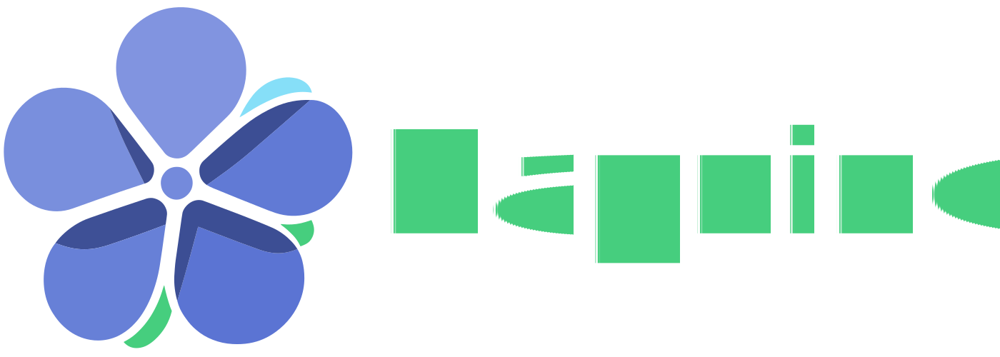

---
hide:
  - toc
  - navigation
---

# Барвінок

<div style="width:75%; display: block; margin: 0 auto" markdown>
 
</div>

<p align="center" markdown>
    *Українська мова програмування українською.*
</p>

---

<div class="cards" markdown>

<div class="card" markdown>
## Барвінок
Високорівнева мова програмування, зорієнтована на об'єктно-орієнтоване програмування та простоту використання.
</div>

<div class="card" markdown>
## Синтаксис
Має простий та інтуїтивно зрозумілий синтаксис, який використовує виключно символи української розкладки.
</div>

<div class="card" markdown>
## Система типів
Барвінок володіє динамічно строгою системою типів.
</div>

</div>

---

<h2 align="center">
    Послідовність Фібоначчі на Барвінку
</h2>

``` periwinkle title="фібоначчі.барвінок"
функція фібоначчі(н)
    якщо н == 0
        повернути 0
    або якщо н == 1 або н == 2
        повернути 1
    кінець
    повернути фібоначчі(н - 1) + фібоначчі(н - 2)
кінець

друкр(фібоначчі(42))
```
